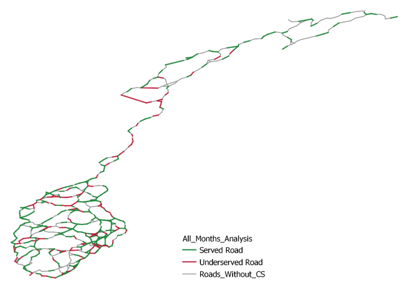

# **OVERVIEW:**

This project examines the infrastructure required to support the rapidly growing Electric Vehicle (EV) market in Norway. Utilizing real-world traffic data, alongside various programming tools and models, we provide an in-depth assessment of the existing EV charging infrastructure. Our focus is on identifying areas of high demand and potential congestion points within the charging network.

Our research is propelled by the creation of a dynamic model, designed to adapt to various parameters and assumptions, thus enabling us to capture a comprehensive picture of the infrastructure challenges. This model draws upon diverse data sources and integrates potential changes in traffic patterns.

For a more detailed understanding of the project's methodology and findings, please refer to the code and data files within this repository.

# REPOSITORY GUIDE:

1. **Main_Folder**: This is the central folder for our research and associated code.

2. **Drafts**: The 'drafts' folder contains both important and not-so-important work carried out during our research. It isn't necessary to view this to understand the project's essentials.

3. **Main_Folder/1.Data_Acquisition**: This section contains each step of the data acquisition process, which includes geo-data for network creation, traffic data for determining demand, and charging station data for supply assessment.

4. **Main_Folder/2.Constructing_Network**: Here, you will find each phase of network creation, from initial data to the simplified network.

5. **Main_Folder/3.Data_Processing**: This section houses the main model's creation and the methodology behind it.

6. **Main_Folder/4.Data_Analysis**: In this section, you will find our cost calculations for meeting infrastructure requirements, as well as the procedures for conducting sensitivity analyses.

7. **Main_Folder/Visualizations/QGIS_Files**: This folder contains GEOJSON files of charging stations, traffic registration points and the simplified network. Can be imported into QGIS for further processing.

Each folder also contains the necessary data files for executing the code files.

  

